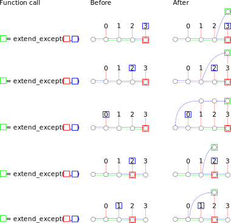

% kakoi - implementation: algorithms


- `init()`: Creates and initializes a new graph
  ```
  Input: (none)
  Output:
  - (Graph, Branch)
  Algorithm:
  (a) Create an empty graph. Call the graph G.
  (a:b) Insert a branch into G. Call the branch N.
  (b:c) Return (G,N) 
  ```
- `is_comitted_transaction(N)`: Checks if a branch has been committed in a transaction
  ```
  Input:
  - N: Branch
  Output:
  - True (when N has already been committed)
  - False (when N hasn't yet been committed)
  Algorithm:
  (a) If N has at least one outgoing green edge, return True.
  (a:b) Return False.
  ```
- `commit_transaction(N,M)`: Commits a transaction atomically
  ```
  Input:
  - N: Branch
  - M: Branch

  Output:
  - True: when the transaction successfully commits.
  - False: when the transaction was already committed.

  Algorithm:
  (a) If is_transaction_committed(M), then return False.
  (a:b) Insert a green edge from M to N.
  (b:c) Return True.
  ```
- `extend(N,M)`: Extends group N to indicate group M
  ```
  Input:
  - N: Branch
  - M: Node
  Output:
  - Branch: the extension of N that indicates M.
  Algorithm:
  (a) Insert a branch. Call the branch B.
  (a:b) Insert a blue edge from B to N.
  (a:c) Insert a red edge from B to M.
  (bc:e) Return B.
  ```
- `insert_leaf(Ldata)`: Inserts data into the graph
  ```
  Input:
  - Ldata: String (only strings types are supported at the moment)
  Output:
  - Leaf: the leaf containing Ldata.
  Algorithm:
  (a) Insert a leaf into the graph containing Ldata. Call the leaf L.
  (a:b) Return L.
  ```
- `extend_with_leaf(N,Ldata)`: Extends a group with new data
  ```
  Input:
  - N: Branch
  - Ldata: String
  Output:
  - Branch: the extension of N that indicates Ldata.
  Algorithm:
  (a) L = insert_leaf(Ldata).
  (b) Return extend(N,L).
  ```
- `reduction_of(N)`: Returns the branch that N extends (if any).
  ```
  Input:
  - N: Branch
  Output:
  - Some<Branch>: when N extends a branch
  - None: when N does not extend a branch (it is the group containing no elements)
  Algorithm:
  If N has no outgoing blue edge, return None.
  Call the node on the incoming side of the outgoing blue edge from N M.
  Return Some(M).
  ```
- `indication_of(N)`: Returns the node that N indicates (if any).
  ```
  Input:
  - N: Branch
  Output:
  - Some<Node>: when N indicates a node.
  - Nothing: when N doesn't indicate a node.
  Algorithm:
  If N has no outgoing red edge, return Nothing.
  Call the node on the incoming side of the outgoing red edge from N M.
  Return Some(M).
  ```
- `extend_except(N,M)`: Creates an extension of N that includes every node it indicates except for M.
  ```
  Input:
    N: Branch
    M: Node
  Output:
    Branch, the extension.
  Algorithm:
  let V = insert_branch()
  let B = V
  let b_has_indication = false
  let R = N
  loop {
    if let Some(I) = indication_of(R) {
      if I == M {
        if let Some(R2) = reduction_of(R) {
          insert_blue_edge(B,R2)
          return V
        } else {
          PANIC
        }
      } else {
        if b_has_indication {
          let B2 = insert_branch()
          insert_blue_edge(B,B2)
          B = B2
        }
        insert_red_edge(B,I)
        b_has_indication = true
      }
    } else {
      // TODO: I think this is a valid state to be in, so we 
      //       should probably do nothing here. Is this actually 
      //       true?
    }
    
    if let Some(R2) = reduction_of(R) {
      R = R2
    } else {
      PANIC
    }
  }
  ```

  

- [Algorithm for adding an existing leaf to the top level of the group drawn
  from the green node](algo-existing-leaf-toplevel.html)

- [Algorithm for removing the last N toplevel nodes of the group drawn from the
  green node](algo-remove-n-toplevel.html)
