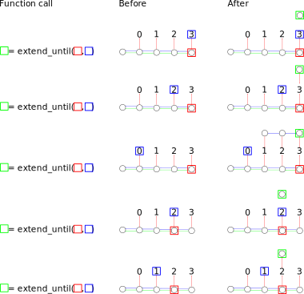
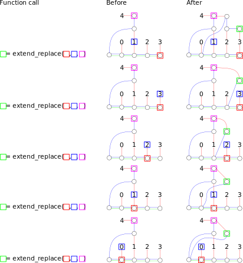
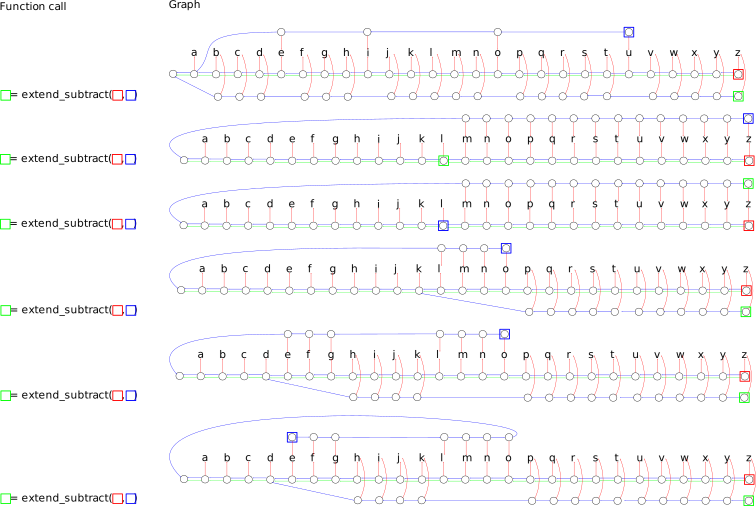

% kakoi - implementation: algorithms


- `init()`: Creates and initializes a new graph
  ```
  Input: (none)
  Output:
  - (Graph, Branch)
  Algorithm:
  (a) Create an empty graph. Call the graph G.
  (a:b) Insert a branch into G. Call the branch N.
  (b:c) Return (G,N) 
  ```
- `is_comitted_transaction(N)`: Checks if a branch has been committed in a transaction
  ```
  Input:
  - N: Branch
  Output:
  - True (when N has already been committed)
  - False (when N hasn't yet been committed)
  Algorithm:
  (a) If N has at least one outgoing green edge, return True.
  (a:b) Return False.
  ```
- `commit_transaction(N,M)`: Commits a transaction atomically
  ```
  Input:
  - N: Branch
  - M: Branch

  Output:
  - True: when the transaction successfully commits.
  - False: when the transaction was already committed.

  Algorithm:
  (a) If is_transaction_committed(M), then return False.
  (a:b) Insert a green edge from M to N.
  (b:c) Return True.
  ```
- `extend(N,M)`: Extends group N to indicate group M
  ```
  Input:
  - N: Branch
  - M: Node
  Output:
  - Branch: the extension of N that indicates M.
  Algorithm:
  (a) Insert a branch. Call the branch B.
  (a:b) Insert a blue edge from B to N.
  (a:c) Insert a red edge from B to M.
  (bc:e) Return B.
  ```
- `insert_leaf(Ldata)`: Inserts data into the graph
  ```
  Input:
  - Ldata: String (only strings types are supported at the moment)
  Output:
  - Leaf: the leaf containing Ldata.
  Algorithm:
  (a) Insert a leaf into the graph containing Ldata. Call the leaf L.
  (a:b) Return L.
  ```
- `extend_with_leaf(N,Ldata)`: Extends a group with new data
  ```
  Input:
  - N: Branch
  - Ldata: String
  Output:
  - Branch: the extension of N that indicates Ldata.
  Algorithm:
  (a) L = insert_leaf(Ldata).
  (b) Return extend(N,L).
  ```
- `reduction_of(N)`: Returns the branch that N extends (if any).
  ```
  Input:
  - N: Branch
  Output:
  - Some<Branch>: when N extends a branch
  - None: when N does not extend a branch (it is the group containing no elements)
  Algorithm:
  If N has no outgoing blue edge, return None.
  Call the node on the incoming side of the outgoing blue edge from N M.
  Return Some(M).
  ```
- `indication_of(N)`: Returns the node that N directly indicates (if any).
  ```
  Input:
  - N: Branch
  Output:
  - Some<Node>: when N indicates a node.
  - Nothing: when N doesn't indicate a node.
  Algorithm:
  If N has no outgoing red edge, return Nothing.
  Call the node on the incoming side of the outgoing red edge from N M.
  Return Some(M).
  ```
- `indications_of(M)`: Returns the nodes that N both directly and indirectly indicates (if any)

  ```
  Input:
    M: Branch
  Output:
    Vector<Node>
  Algorithm:
    let V = new_vector()
    let CM = M
    loop {
      if let Some(I) = indication_of(CM) {
        V.push(I)
      }
      
      if let Some(R) = reduction_of(CM) {
        CM = R
      } else {
        return V
      }
    }
  ```

- `extend_until(M,N)`: Creates a branch that indicates every node M indicates except for N and all of the nodes that come after N

  ```
  Input:
    M: Branch
    N: Node
  Output:
    (Branch,Branch,Branch): (top-level node in extension, 
                             first node in extension,
                             node in M directly indicating N)
  Algorithm:
    let V = insert_branch()
    let B = V
    let b_has_indication = false
    let R = M
    loop {
      if let Some(I) = indication_of(R) {
        if I == N {
          Return (V,B,R)
        } else {
          if b_has_indication {
            let B2 = insert_branch()
            insert_blue_edge(B,B2)
            B = B2
          }
          insert_red_edge(B,I)
          b_has_indication = true
        }
      } else {
        // TODO: I think this is a valid state to be in, so we 
        //       should probably do nothing here. Is this actually 
        //       true?
      }
      
      if let Some(R2) = reduction_of(R) {
        R = R2
      } else {
        PANIC
      }
    }
  ```

  
  
- `extend_except(M,N)`: Creates an extension of N that includes every node it indicates except for M.

  ```
  Input:
    M: Branch
    N: Node
  Output:
    Branch, the extension
  Algorithm
    let (V,B,R) = extend_until(M,N)
    if let Some(R2) = reduction_of(R) {
      insert_blue_edge(B,R2)
      return V
    } else {
      PANIC
    }
  ```


- `extend_replace(M,N,O)`: Creates an extension of M that includes every node it indicates except for N, which is replaced with O.

  ```
  Input:
    M: Branch
    N: Node
    O: Node
  Output:
    Branch
  Algorithm:
    let (V,B,R) = extend_until(M,N)
    let P = B
    if P == V {
      insert_red_edge(B,O)
    } else {
      P = insert_branch()
      insert_blue_edge(B,P)
      insert_red_edge(P,O)
    }
    if let Some(R2) = reduction_of(R) {
      insert_blue_edge(P,R2)
      return V
    } else {
      PANIC
    }
  ```
  
  
  
- `extend_subtract(M,N)`: Creates an extension of M that includes every node it indicates, except for those indicated by N.

  I haven't convinced myself this works yet:

  ```
  Input:
    M: Branch
    N: Branch
  Output:
    Branch
  Algorithm:
    if M == N {
      Call the node with no outgoing edges Z.
      return Z
    } else {
      let start = M
      let end = M
      let B_op = None
      let indications = indications_of(N)
      let inside = false
      loop {
        if let Some(I) = indication_of(end) {
          if inside {
            if indications.contains(I) {
              if let Some(R) = reduction_of(end) {
                end = R
              } else {
                PANIC
              }

              start = end;
            } else {
              start = end
              inside = false
            }
          } else {
            if indications.contains(I) {
              let (V,B2,R) = extend_until(start,I)
              
              if let Some(B) = B_op {
                insert_blue_edge(B,V)
              }
              
              B_op = Some(B2)
              
              inside = true
            } else {
              if let Some(R) = reduction_of(end) {
                end = R
              } else {
                PANIC
              }
            }
          }
        } else {
          if let Some(R) = reduction_of(end) {
            end = R
          } else {
            if let Some(B) = B_op {
              insert_blue_edge(B,start)
              return 
            } else {
              return start
            }
          }
        }
      }
    }
  ```
  
  

- `select(), group(), and extend()`

  Not aware of how these work yet. Here's a diagram to get us started, though.

  
