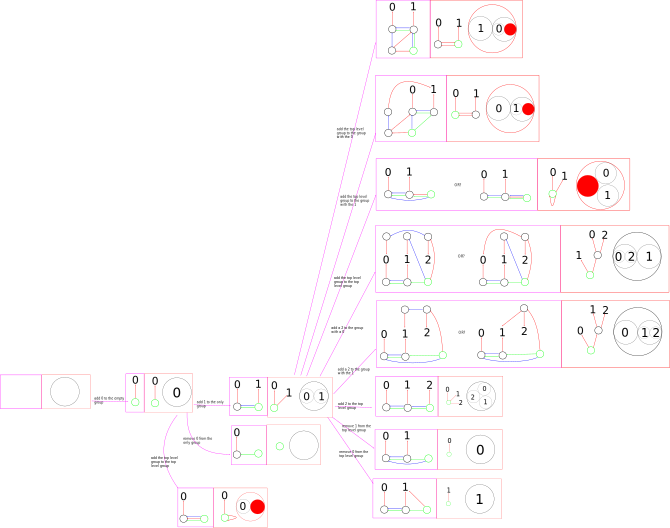

% kakoi - implementation: building

You can drag this image into a new tab and zoom in to get a closer look at it.
In each purple box lies a red-blue-green graph. Paired with each purple box is a
red box that contains both the red graph corresponding to that red-blue-green
graph, as well as the visualization of that red graph. A purple arrow connecting
purple box `A` to purple box `B` indicates that there is a possible editing
action that transforms the graph from the one in `A` to the one in `B`. Each
purple arrow is labeled with the editing action taken. If a visualization has a
filled red circle and outlined red circle inside of it, it is a recursive
visualization. The filled red circle is meant to indicate the outlined red
circle. In the software we would recursively replace the filled red circle with
the contents of the outlined red circle.

