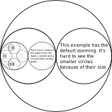
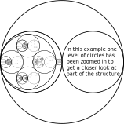
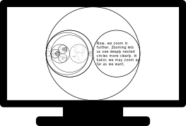

% kakoi - implementation: zooming

[kakoi](kakoi.html) makes liberal use of *zooming* in and out. Everything drawn
in kakoi should be scalable, meaning that it can be viewed up close without
being pixelated or blurry.

The images above are quite small. When actually using [kakoi](kakoi.html), the
outer circle would fill the screen such that its circumference touches the
borders of the smallest screen dimension. [kakoi](kakoi.html) is meant to
utilize screen space as efficiently as possible.

